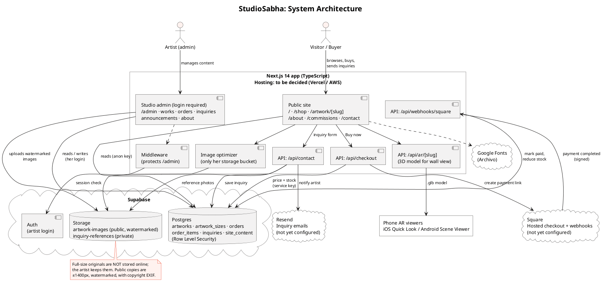
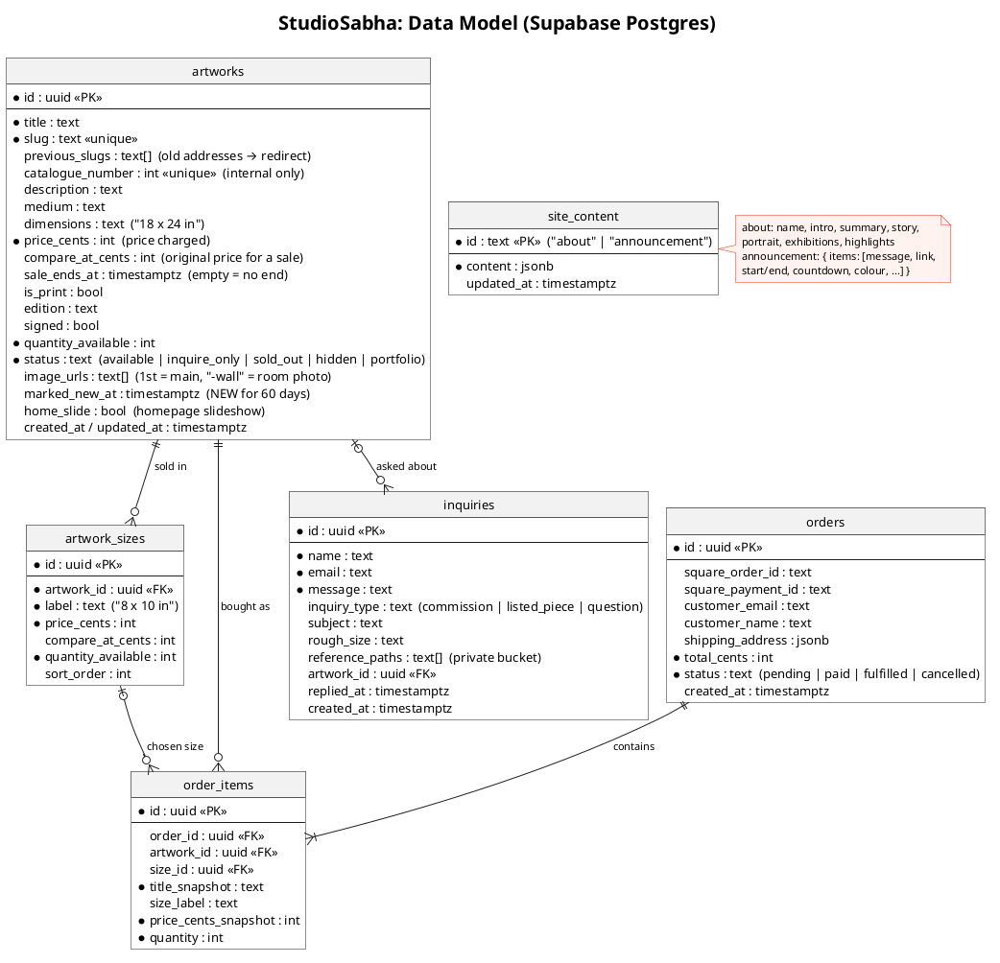
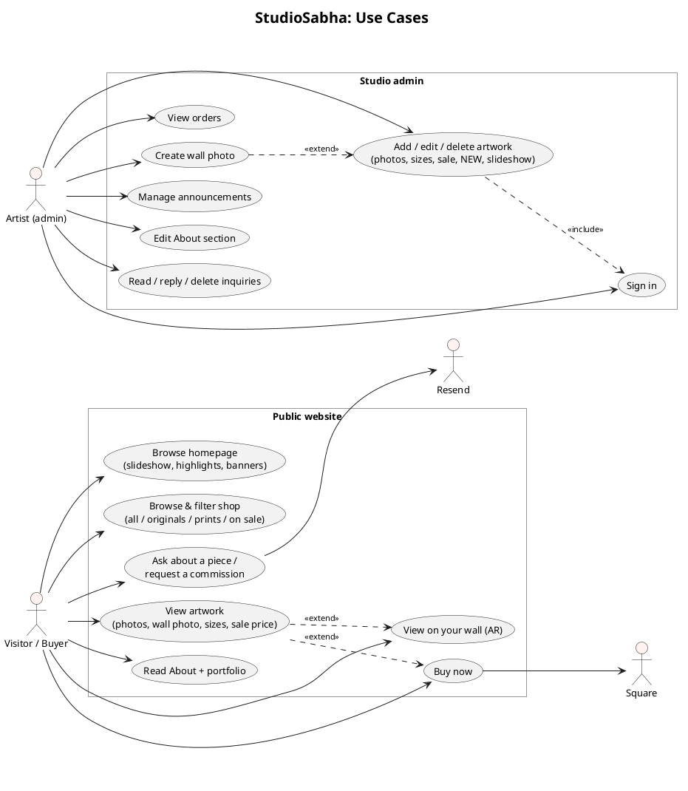
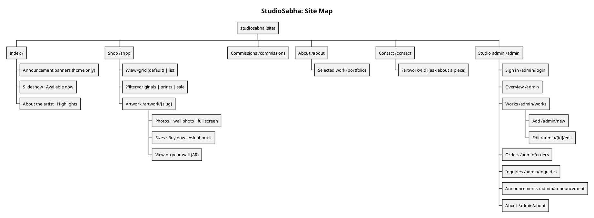
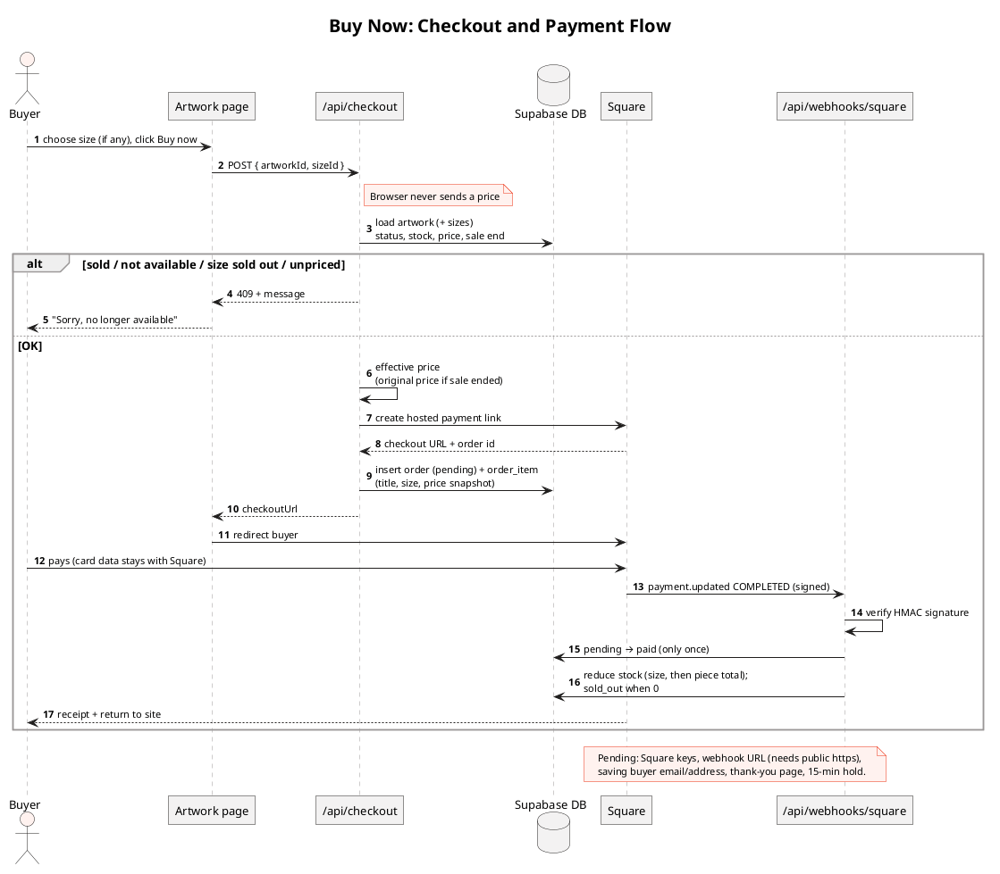
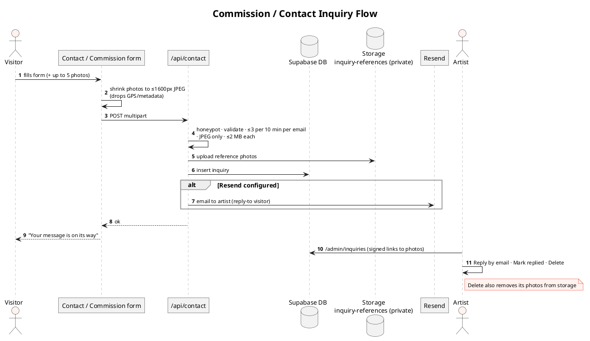
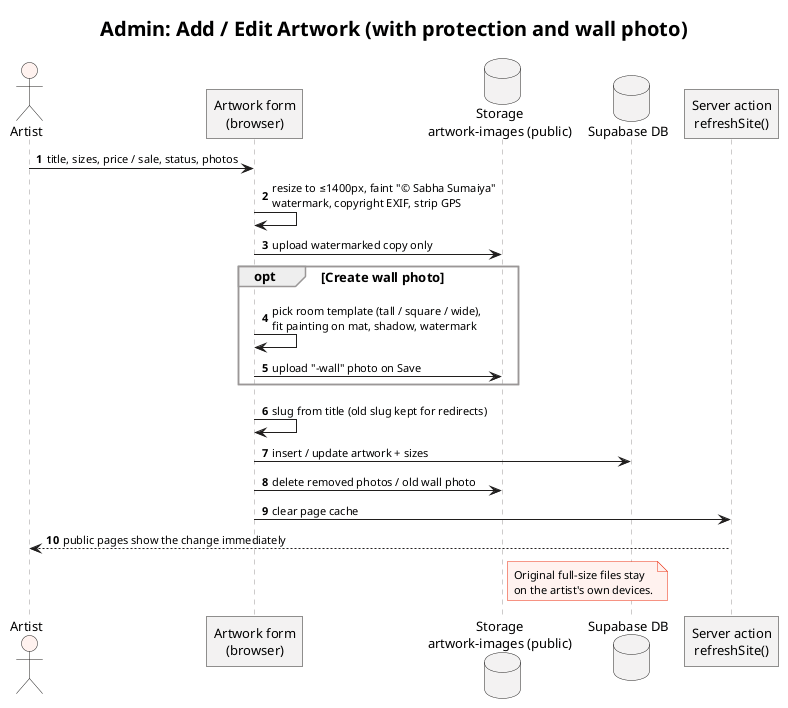
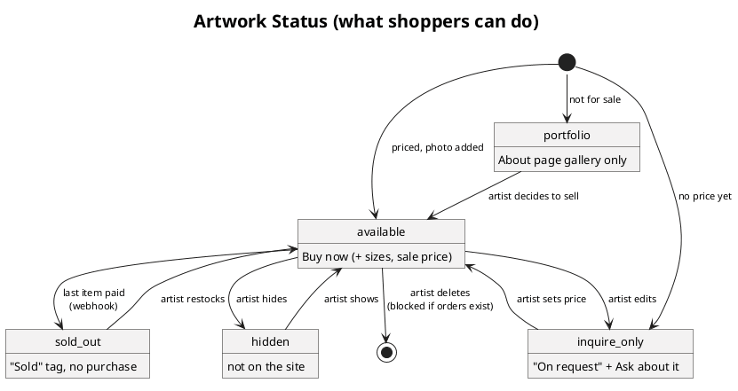
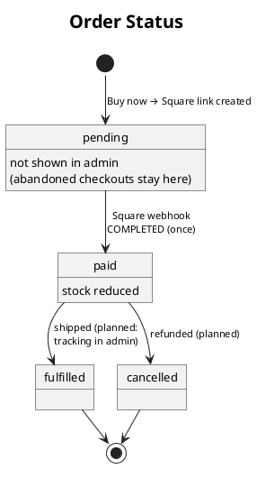
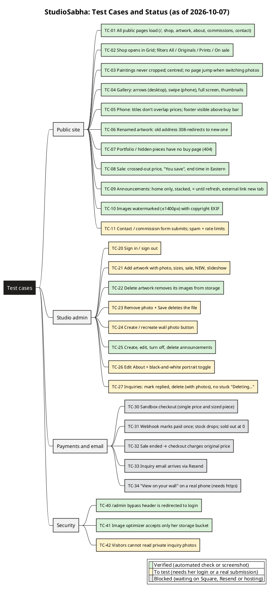

# StudioSabha

A custom e-commerce website built for independent artist **Sabha** to showcase her artwork, manage inventory, sell pieces directly online, and accept custom commission requests.

## About

My cousin contacted me to create a website where she can showcase her art and potentially sell it. We are calling it StudioSabha; Sabha is my cousin's name. StudioSabha is a custom e-commerce website for an independent artist to sell her work directly online. It includes inventory management, a commission request form, a non-technical admin dashboard for managing artwork and orders, a "see it on your wall" feature, and will be deployed to a `.com` domain.

## Tech stack

| Layer | Technology |
|---|---|
| Web app | Next.js 14 (App Router), TypeScript, Tailwind CSS |
| Database, login, image storage | Supabase (Postgres, Auth, Storage) |
| Payments | Square Checkout API (integration built, account not yet connected) |
| Email | Resend (integration built, account not yet connected) |
| "View on your wall" | Google model-viewer (iPhone AR Quick Look, Android Scene Viewer) |
| Hosting | To be decided (Vercel or AWS Amplify) |

## Features

**Public site**
- **Index:** announcement banners, a homepage slideshow, available work, About the artist and highlights.
- **Shop:** grid or list view, with filters for originals, prints and pieces on sale.
- **Artwork pages:** full, uncropped photos plus a "painting on a wall" room photo, sizes with their own price and stock, sale prices with an end date, **Buy now** or **Ask about it**, and **View on your wall** (real-size AR on phones).
- **About:** the artist's bio, exhibitions and a portfolio of work not for sale.
- **Commissions and Contact:** an inquiry form with optional reference photos.

**Studio admin (login required)**
- Add, edit and delete artwork: photos, sizes, sale prices, NEW label, homepage slideshow, status.
- Create "painting on a wall" photos from room templates.
- View orders; reply to, mark and delete inquiries.
- Schedule homepage announcements, with optional countdowns.
- Edit the About section, portrait and exhibitions.

**Image protection:** stored images are web-sized (at most 1400px), carry a faint "© Sabha Sumaiya" watermark and copyright information, and have location data removed. Full-size originals are not stored online.

## Progress against the task list

Prioritized tasks from [PROCESS.md](PROCESS.md):

| # | Task | Status |
|---|---|---|
| 1 | Artwork upload with images, title, medium and price | Done |
| 2 | Availability status (available, reserved, sold) | Partly done: available, sold, inquire only, portfolio and hidden exist; **reserved** not yet |
| 3 | Public gallery to browse artwork | Done |
| 4 | Custom commission request form | Done |
| 5 | Non-technical admin dashboard for artwork and orders | Done |
| 6 | "See it on your wall" preview | Done (phone AR and room photos) |
| 7 | Secure online payment | In progress: checkout and payment webhook built; Square account not yet connected |
| 8 | Deploy to a custom `.com` domain | Not started (hosting being decided) |

## Diagrams

PlantUML sources are in [`docs/diagrams/`](docs/diagrams/); rendered images are below.

### System architecture
How the website, Supabase, Square, Resend and the phone AR viewers fit together.



### Data model
The database tables and how they relate.



### Use cases
What visitors and the artist can do.



### Site map
Every public and admin page.



### Checkout and payment
From **Buy now** to Square and back through the payment webhook. The price always comes from the database, never the browser.



### Commission and contact inquiries



### Adding artwork in the admin
Image protection, wall photos and the instant site refresh.



### Artwork and order statuses





### Test cases
Each test case with its current status: verified, still to test (needs the artist's login or a real submission), or blocked (waiting on Square, Resend or hosting).



## Project structure

```
app/            pages and API routes (public site, /admin, /api/*)
components/     shared UI components
lib/            data access, pricing, image protection, helpers
middleware.ts   protects /admin
supabase/       schema.sql and migrations/
public/         static files and room templates
docs/           SETUP.md and diagrams/ (PlantUML + PNG)
```

## Getting started

```bash
npm install
cp .env.example .env.local   # add the Supabase / Square / Resend keys
npm run dev                  # http://localhost:3000
```

`.env.local` holds secret keys and is excluded by `.gitignore`; never commit it. Without Supabase keys, the site runs in demo mode with sample artwork.

Database setup, configuration and deployment steps are in [docs/SETUP.md](docs/SETUP.md). To regenerate the diagram images, see [docs/diagrams/README.md](docs/diagrams/README.md).

## Team

- Reza Shahwaz
- Laura Wilson
